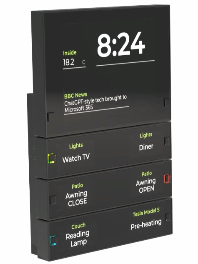

# Button+ integration for Home Assistant

  
This integration allows you to set up and control your Button+ device from Home Assistant.

Currently, this project is in development and **highly** unstable.

## Documentation

[Documentation](https://github.com/koenhendriks/ha-button-plus/wiki) can be found in the [wiki](https://github.com/koenhendriks/ha-button-plus/wiki) of this repo.

## Testing
You can start a mosquitto broker and Home Assistant with this integration in it with Docker Compose.
Make sure Docker is installed and run the `docker_compose.sh` script. This script will completely reset
the docker image every time, making sure there is a clean environment.

When you run the script, after a while:
- A browser window will open, if not, browse to http://localhost:8123.
- Setup Home Assistant with a user and location.
- Add the MQTT integration, use hostname `mosquitto` (no user/pw required).
- Add the Button+ integration to test, the MQTT broker should be prefilled.
- Your terminal will attach to the Home Assistant docker, showing you logs
- Detach with CTRL + C, the docker images will automatically be stopped.

**Note:** This will allow you to setup a real Button+ device and see if setup works.
Actual communication with the device will not work unless the broker is reachable from Button+.